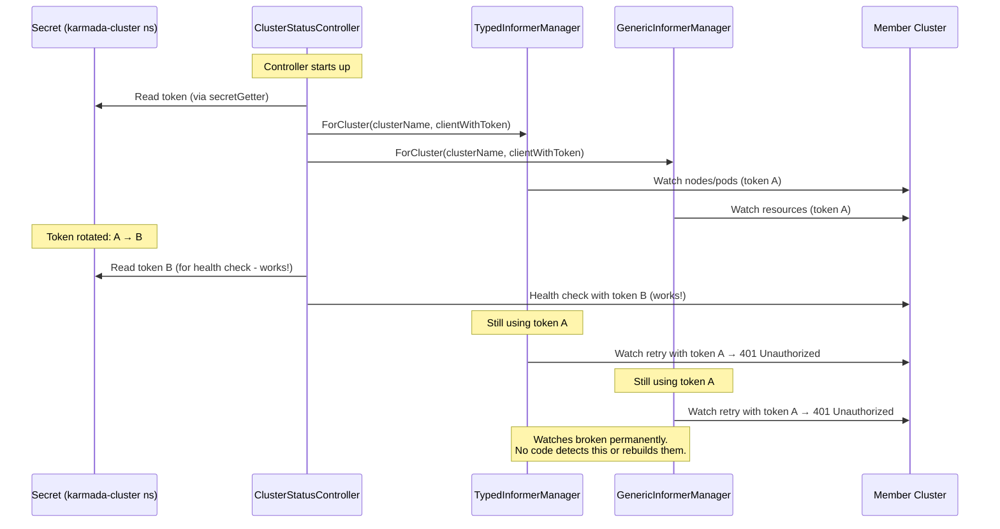
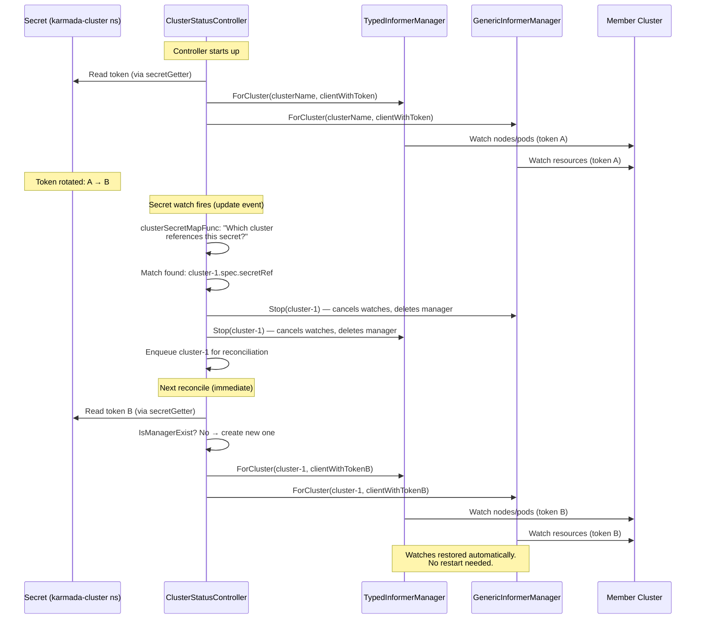
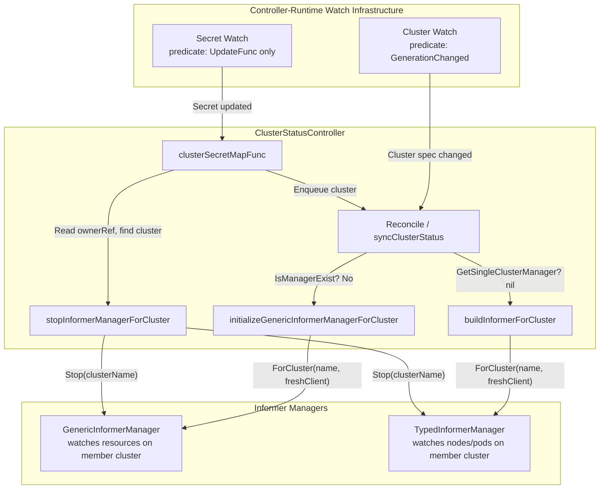
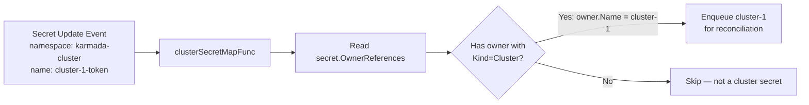

# Options for Handling Secret Rotation in Push-Mode Clusters

This document covers the available options for ensuring Karmada continues to function correctly after a push-mode cluster's secret token is rotated, and provides a recommendation.

For the full technical analysis of what breaks and why, see [karmada-secret.md](karmada-secret.md).

---

## The Problem

After a token rotation, Karmada's long-lived informer watches on member clusters break because they hold a client with the old token baked in. Health checks and resource pushing continue to work (they use fresh credentials), but Karmada loses observability into member clusters — resource modeling freezes, work status stops updating, and drift detection breaks. This does not self-heal. See [karmada-secret.md](karmada-secret.md) for full details.

### Why it happens

The root cause is an architectural mismatch between how different operations obtain credentials:

**Health checks and resource pushing** — call `ClusterClientSetFunc` → `BuildClusterConfig` → `secretGetter` on every operation. The token is read fresh from the Secret each time. These always work after rotation.

**Informer watches** — created once via `ForCluster()` with a Kubernetes client. That client was built from a `rest.Config` with the token embedded as a static string:

```go
// membercluster_client.go:220-224
clusterConfig := &rest.Config{
    BearerToken: string(token),  // static snapshot — never refreshed
    Host:        apiEndpoint,
    Timeout:     defaultTimeout,
}
```

Every client built from this config inherits that static token. The informer's HTTP watch connection uses this client for its entire lifetime. After token rotation, the watch breaks with 401 and retries indefinitely with the same stale token — never recovering.

### How informers are currently managed

Understanding how the `ClusterStatusController` manages informers today makes it clear where the gap is.

**The controller only watches Cluster objects** (`cluster_status_controller.go:173-178`):

```go
return controllerruntime.NewControllerManagedBy(mgr).
    Named(ControllerName).
    For(&clusterv1alpha1.Cluster{}, builder.WithPredicates(c.PredicateFunc, predicate.GenerationChangedPredicate{})).
    ...Complete(c)
```

There is no watch on Secrets. Reconcile is triggered only by Cluster create/update/delete events and by the periodic requeue (default every 10 seconds).

#### Cluster creation — informers are built lazily

When a new Cluster object is created, `Reconcile` fires and calls `syncClusterStatus`. Informers are **not** created eagerly — they are only initialized if the cluster passes health checks (`cluster_status_controller.go:212`):

```go
if online && healthy && readyCondition.Status == metav1.ConditionTrue {
    c.initializeGenericInformerManagerForCluster(clusterClient)  // line 223
    // ...
    c.buildInformerForCluster(clusterClient)                     // line 265 (inside setCurrentClusterStatus)
}
```

Both methods check whether a manager already exists before creating one:

- **GenericInformerManager** (`cluster_status_controller.go:339`): `IsManagerExist` returns false → calls `ClusterDynamicClientSetFunc` to build a dynamic client → `ForCluster()` registers the manager
- **TypedInformerManager** (`cluster_status_controller.go:354`): `GetSingleClusterManager` returns nil → `ForCluster()` creates the manager with `clusterClient.KubeClient`

The client used by both managers is built fresh at the top of `syncClusterStatus` (line 191) via `ClusterClientSetFunc` → `BuildClusterConfig` → `secretGetter`. The token is baked into the client at that point.

#### Cluster deletion — informers are torn down immediately

When `Reconcile` runs and `client.Get` returns `IsNotFound` (`cluster_status_controller.go:133-147`):

```go
if apierrors.IsNotFound(err) {
    c.GenericInformerManager.Stop(req.NamespacedName.Name)   // cancel watches, delete from map
    c.TypedInformerManager.Stop(req.NamespacedName.Name)     // cancel watches, delete from map
    c.clusterConditionCache.delete(req.NamespacedName.Name)
    metrics.CleanupMetricsForCluster(req.NamespacedName.Name)
    // stop lease controller (pull-mode only)
    ...
}
```

`Stop()` on both managers cancels the manager's context (killing all watch goroutines) and deletes the entry from the managers map under a lock.

#### Secret rotation — nothing happens (the gap)

The controller has no watch on Secrets. When a credential Secret is updated:

- No event fires. No reconcile is triggered by the Secret change itself.
- The periodic requeue does trigger `syncClusterStatus` every ~10 seconds, which builds a **fresh client** for health checks (line 191). Health checks pass.
- But the informer creation path is **skipped** because `IsManagerExist` / `GetSingleClusterManager` returns the existing (stale) manager. The check-then-skip logic that makes lazy initialization efficient is the same logic that prevents stale managers from being replaced.
- The stale managers continue running with the old token, failing silently with 401 on every watch retry.

This is the exact gap that Option 5 fills — adding a Secret watch that calls `Stop()` on both managers when a credential Secret changes, causing the next reconcile to see "manager doesn't exist" and rebuild with fresh credentials through the existing lazy initialization path.

---

## Operational Options

### Option 1: Restart the karmada-controller-manager after each rotation

Restart the `karmada-controller-manager` after rotating the secret. This destroys all in-memory informer managers, forcing them to be recreated with fresh credentials on startup.

**Pros:**
- Simple and reliable — guarantees all informers are rebuilt
- controller-runtime handles leader election gracefully
- With 2+ replicas and leader election, the standby picks up the lease within ~15-25 seconds (default lease duration: 15s per `cmd/controller-manager/app/options/options.go:39`)
- Can be automated with a sidecar, CronJob, or post-rotation hook that triggers a rollout restart

**Cons:**
- During the leadership transition (~15-25 seconds), no controllers are running — no health checks, no reconciliation, no resource pushing
- Informer caches for **all** clusters are destroyed, not just the one whose token rotated — causes a cold-start burst of list/watch API calls to every member cluster
- If many clusters rotate tokens at different times, frequent restarts amplify the cold-start cost

**Side effects:**
- A healthy cluster will **not** be erroneously marked unhealthy during the restart. Three mechanisms prevent this:
  1. The health check uses a fresh client with valid credentials (`cluster_status_controller.go:191`)
  2. The threshold cache starts empty after restart, but when `saved == nil`, it returns the observed (healthy) condition directly (`cluster_condition_cache.go:45-51`)
  3. The cluster-controller's lease-based health monitor skips push-mode clusters entirely (`cluster_controller.go:510-512`)
- If `buildInformerForCluster` times out during cold start, the error triggers a retry — it does NOT mark the cluster unhealthy (the error is returned from `setCurrentClusterStatus` without calling any status condition update)

### Option 2: Always update the secret in-place (never delete-then-create)

Use `kubectl patch` or a controller that updates the Secret's `.data.token` field atomically rather than deleting and recreating the secret.

**Pros:**
- Avoids the edge case where `BuildClusterConfig` fails because the secret is briefly missing. While this failure still goes through the 30-second `ClusterFailureThreshold` before marking the cluster unhealthy (`cluster_status_controller.go:196` calls `thresholdAdjustedReadyCondition`), the repeated failures during the missing-secret window start the threshold clock ticking unnecessarily.

**Cons:**
- Does not fix the stale informer problem — you still need another option in addition to this
- This is a best practice for secret rotation regardless, not a standalone solution

### Option 3: Remove and re-join the cluster after rotation

Delete the Cluster object and re-register the cluster. Deleting the Cluster triggers `GenericInformerManager.Stop()` and `TypedInformerManager.Stop()` (`cluster_status_controller.go:134-135`), and re-joining creates fresh informers.

**Pros:**
- Only affects the single cluster whose token was rotated — no blast radius to other clusters

**Cons:**
- Highly disruptive — all Work objects and ResourceBindings for that cluster are affected
- The cluster goes through the full join lifecycle (execution space creation, finalizer setup, informer initialization)
- Not practical for routine rotation

### Option 4: Align token lifetime with controller-manager restart cadence

Ensure tokens live longer than the longest interval between controller-manager restarts (e.g., during upgrades, node rotation, or scheduled maintenance).

**Pros:**
- No additional automation needed if restarts already happen frequently enough

**Cons:**
- Fragile — depends on external restart patterns that may change
- Not a fix, just a coincidence-based workaround
- If the controller-manager happens to run longer than the token lifetime, the stale informer problem occurs silently

---

## Operational Recommendation

**For environments with a small number of clusters (~10) and infrequent rotation (e.g., every 24 hours):**

Use **Option 1 + Option 2** together:

1. **Always rotate secrets in-place** (Option 2) — update `.data.token` atomically, never delete-then-create.

2. **Automate a rolling restart of karmada-controller-manager after rotation** (Option 1) — this rebuilds all informers with fresh credentials.

**Practical approach:** If all clusters rotate on the same 24-hour schedule, rotate all secrets at the same time and do a single restart. One ~15-25 second gap per day, affecting no cluster health status.

**What the restart costs you:**
- ~15-25 seconds of no controller activity (bounded by leader election lease duration)
- A burst of list/watch API calls to all member clusters as informer caches cold-start
- Both resolve within seconds of the new leader starting

**What the restart prevents:**
- Frozen resource modeling (stale `Cluster.Status.ResourceSummary`)
- Stale work status (Work objects not reflecting reality)
- Broken drift detection
- All of the above persisting permanently with no visibility

---

## Code-Level Fix Options

The operational options above are workarounds. The real fix is in the code. Below are the viable approaches to solving this in `karmada-controller-manager` itself.

### Why a code fix is needed

The stale informer problem is a bug — the controller should handle credential rotation without external intervention. The operational workarounds have costs (downtime, blast radius, operational complexity) that scale poorly and are easy to forget.

### Option 5: Watch Secrets and Rebuild Informers (Recommended)

Make the `ClusterStatusController` watch for Secret changes and automatically stop/recreate the informer managers for the affected cluster.

#### How it works today (the problem)



#### How it works after the fix



#### Architecture of the fix



#### The mapping function — how it knows which cluster a Secret belongs to

Karmada sets owner references on credential Secrets during cluster registration (`pkg/util/credential.go:193-212`). After the Cluster object is created, a merge patch adds a `ControllerReference` on the Secret pointing to the owning Cluster:

```go
// credential.go:193-208
patchSecretBody := &corev1.Secret{
    ObjectMeta: metav1.ObjectMeta{
        OwnerReferences: []metav1.OwnerReference{
            *metav1.NewControllerRef(cluster, clusterResourceKind),
        },
    },
}
```

This is valid because Kubernetes allows cluster-scoped resources (which `Cluster` is — `+genclient:nonNamespaced` in `pkg/apis/cluster/v1alpha1/types.go:37`) to own namespaced resources.

The mapping function can use this owner reference directly — no need to list all Cluster objects:



This is O(1) per Secret update — just iterate the (typically 1-element) `OwnerReferences` slice and check for `Kind: "Cluster"`. No API calls, no listing, no string matching against `spec.secretRef`.

#### What changes in the code

**Single file modified:** `pkg/controllers/status/cluster_status_controller.go`

| Change | Lines added | Purpose |
|---|---|---|
| `clusterSecretMapFunc` method | ~15 | Reads the Secret's `OwnerReferences` for a `Cluster` owner and enqueues it; also stops both informer managers for that cluster |
| `stopInformerManagerForCluster` method | ~4 | Calls `Stop()` on both `GenericInformerManager` and `TypedInformerManager` |
| Update `SetupWithManager` | ~8 | Adds `.Watches(&corev1.Secret{}, ...)` with an update-only predicate |
| **Total** | **~60 lines** | |

#### Why no other changes are needed

The existing reconcile loop already handles the "manager doesn't exist" case:

1. `initializeGenericInformerManagerForCluster` (`cluster_status_controller.go:339-340`) checks `IsManagerExist` — if the manager was stopped (deleted from map), this returns `false`, and a new manager is created with a fresh client.

2. `buildInformerForCluster` (`cluster_status_controller.go:354-357`) checks `GetSingleClusterManager` — if the manager was stopped, this returns `nil`, and a new manager is created with `clusterClient.KubeClient` (freshly built from the updated secret).

3. The periodic requeue (configurable via `ClusterStatusUpdateFrequency`, default 10s) ensures reconciliation happens promptly even without the Secret watch triggering it — the watch just makes it immediate rather than waiting up to one cycle.

#### Why this is safe

**`Stop()` is non-destructive and non-blocking:**
- `GenericInformerManager.Stop` (`fedinformer/genericmanager/multi-cluster-manager.go:132-141`): calls `manager.Stop()` (which is just `cancel()` on a context), then deletes from the managers map under a lock.
- `TypedInformerManager.Stop` (`fedinformer/typedmanager/multi-cluster-manager.go:141-150`): same pattern.
- Both are safe to call while a reconcile is in progress — worst case, the in-progress reconcile uses the old manager for one last cycle, and the next cycle rebuilds.

**The pattern is already proven in this codebase:**
- Metrics adapter (`pkg/metricsadapter/controller.go:277-281`) calls `stopInformerManager` which does exactly `TypedInformerManager.Stop` + `InformerManager.Stop`.
- Search controller (`pkg/search/controller.go:266,274,280`) calls `InformerManager.Stop` on multiple trigger conditions (cluster not found, being deleted, not ready).

**The Secret watch predicate limits noise:**
- Only `UpdateFunc` fires (not Create/Delete/Generic)
- Secret creates don't matter (the informer doesn't exist yet anyway)
- Secret deletes are handled by the existing `BuildClusterConfig` failure path

---

### Option 6: Dynamic Token Round-Tripper

Instead of rebuilding informers, inject a custom `http.RoundTripper` into the `rest.Config` that reads the token fresh from the Secret on each HTTP request (with caching to avoid excess API calls).

Karmada already uses this pattern — `pkg/util/round_trippers.go` implements `proxyHeaderRoundTripper` which wraps transport via `rest.Config.Wrap()` at `membercluster_client.go:247`.

#### How it would work

```go
type tokenRefreshRoundTripper struct {
    clusterName  string
    secretNs     string
    secretName   string
    secretGetter func(string, string) (*corev1.Secret, error)
    roundTripper http.RoundTripper

    mu          sync.RWMutex
    cachedToken string
    tokenExpiry time.Time
    cacheTTL    time.Duration  // e.g., 60 seconds
}

func (r *tokenRefreshRoundTripper) RoundTrip(req *http.Request) (*http.Response, error) {
    token, err := r.getToken()  // returns cached or fetches fresh
    if err != nil {
        return nil, err
    }
    req = req.Clone(req.Context())
    req.Header.Set("Authorization", "Bearer "+token)
    return r.roundTripper.RoundTrip(req)
}
```

In `BuildClusterConfig`, instead of setting `BearerToken` directly:
```go
clusterConfig.Wrap(NewTokenRefreshRoundTripperWrapper(secretGetter, namespace, name, 60*time.Second))
```

#### Why this does NOT fix long-lived watches

**This is the critical flaw.** A Kubernetes watch is a single HTTP request with a streaming response:

1. `RoundTrip()` is called **once** to initiate the watch
2. The response body streams indefinitely — no further `RoundTrip()` calls
3. After token rotation and revocation, the server closes the stream (401)
4. The informer retries — this **does** call `RoundTrip()` again, and the round-tripper provides the fresh token

So the sequence is:
```
Watch established with token A (single RoundTrip call)
    ↓
Token rotated: A → B, token A revoked
    ↓
Server rejects the stream → 401 / connection closed
    ↓
Informer retry → new RoundTrip() → gets fresh token B → watch re-established
```

This is **better than today** (where retries also use stale token A and fail forever), but it is **not seamless**:
- The watch still breaks on rotation
- There is a gap between revocation and recovery (depends on how quickly the server rejects the old token)
- The informer must re-list all resources after re-establishing the watch

#### Comparison with Option 5

| Dimension | Option 5 (Watch + Rebuild) | Option 6 (Round-Tripper) |
|---|---|---|
| Watch breaks on rotation? | Yes (proactively torn down) | Yes (reactively, on 401) |
| Recovery trigger | Immediate — Secret watch fires | Delayed — waits for server to reject old token |
| Re-list required? | Yes (new informer) | Yes (informer retry re-lists) |
| Blast radius | One cluster | One cluster |
| Code location | Controller-level | Transport-level (shared infrastructure) |
| Scope of fix | ClusterStatusController's informers | All clients from BuildClusterConfig |
| Complexity | ~60 lines in one controller file | ~60 lines in shared util + BuildClusterConfig change |
| Error handling | Simple (Stop is non-blocking) | Complex (secretGetter failure inside RoundTrip) |
| Hot path impact | None (only fires on Secret update) | Every HTTP request (cache check) |

#### Verdict

The round-tripper approach ensures retries succeed (fixing the "loops on 401 forever" bug) but does **not** prevent the watch from breaking. Option 5 also doesn't prevent the break but recovers **proactively** (the moment the Secret changes) rather than **reactively** (waiting for the server to reject the old token). Both options require a re-list.

---

### Option 7: Use `BearerTokenFile` with a Token File Sync

Kubernetes `rest.Config` supports `BearerTokenFile` — client-go re-reads the token file on each request via its built-in `tokenFileRoundTripper`. Instead of embedding the token string, write the token to a file and point the config at it.

#### How it would work

1. In `BuildClusterConfig`, write the token to `/tmp/karmada-tokens/<cluster-name>/token`
2. Set `clusterConfig.BearerTokenFile = path` instead of `clusterConfig.BearerToken = string(token)`
3. A sidecar or controller watches Secrets and updates the token files when they change

#### Why this is a poor fit

- Requires a file-system side channel — managing token files, permissions, cleanup
- Karmada stores credentials in Kubernetes Secrets, not files. This adds a translation layer.
- Still needs something to watch Secrets and write files — doesn't eliminate the watch logic, just moves it to a different process
- Same fundamental limitation as Option 6 for long-lived watches — `BearerTokenFile` is read per-request, but the watch is a single long-lived request
- Race conditions between file writes and file reads
- Doesn't fit the architecture at all

---

### Option 8: Token-Aware Client Provider (Interface Change)

Instead of passing a static `kubernetes.Interface` or `dynamic.Interface` to the informer managers, change the `ForCluster` interface to accept a client-provider function that rebuilds the client when needed.

#### Why this doesn't work

- Requires changing the `MultiClusterInformerManager` interface — `ForCluster(name, client, resync)` would need a new signature
- Breaks the existing API contract used by multiple controllers
- Kubernetes informers internally hold a reference to the client — you **cannot** swap the client under a running informer. The informer must be stopped and restarted regardless.
- Massive blast radius — touches shared interfaces across the entire codebase
- Doesn't avoid the informer restart because informers don't support client hot-swap

---

## Code Fix Recommendation

**Use Option 5 (Watch Secrets and Rebuild Informers).**

It is the right fix because:

1. **Proactive recovery** — detects the rotation immediately via Secret watch, rather than waiting for the server to reject the old token
2. **Minimal blast radius** — only the affected cluster's informers are rebuilt
3. **Uses proven patterns** — the exact same Stop-and-rebuild pattern exists in the metrics adapter and search controller
4. **Simple implementation** — ~60 lines in a single file, no interface changes, no shared infrastructure modifications
5. **No hot-path impact** — the Secret watch only fires when a Secret is actually updated, unlike a round-tripper that runs on every HTTP request
6. **Works with the architecture** — the existing reconcile loop already handles the "manager doesn't exist" case, so only the trigger mechanism needs to be added

The round-tripper approach (Option 6) could be used as a **complementary defense-in-depth measure** — ensuring that if the Secret watch somehow misses an update, the informer retries will eventually succeed. But it should not be the primary fix because it recovers reactively rather than proactively.

### Comparison of all code-level options

| Dimension | Option 5 (Watch + Rebuild) | Option 6 (Round-Tripper) | Option 7 (BearerTokenFile) | Option 8 (Interface Change) |
|---|---|---|---|---|
| Fixes the bug? | Yes | Partially (reactive) | Partially (reactive) | No (informers can't hot-swap) |
| Recovery speed | Immediate | Delayed (waits for 401) | Delayed (waits for 401) | N/A |
| Code complexity | ~60 lines, one file | ~60 lines, shared infra | External process + files | Interface-wide refactor |
| Blast radius of change | One controller | All BuildClusterConfig callers | Operational (filesystem) | Entire informer subsystem |
| Proven pattern in codebase? | Yes (metrics adapter, search) | Yes (proxyHeaderRoundTripper) | No | No |
| Hot-path impact | None | Every HTTP request | Every HTTP request | N/A |
| Risk | Low | Medium (error in RoundTrip) | High (filesystem deps) | Very High (API break) |

---

## Reliability Assessment

**Option 5 — High confidence.** The fix is:
- ~60 lines of straightforward code
- Uses patterns already proven in two other Karmada controllers
- No API changes, no new dependencies, no new CRDs
- No behavioral change for non-rotation scenarios (the Secret watch is idle unless a secret actually changes)
- The reconcile loop is unchanged — only the trigger mechanism is added
- Testable with standard unit tests (mock the informer managers, verify Stop is called on secret update)

---

## Key Configuration Defaults

| Parameter | Default | File |
|---|---|---|
| Leader election lease duration | 15s | `cmd/controller-manager/app/options/options.go:39` |
| Leader election renew deadline | 10s | `cmd/controller-manager/app/options/options.go:40` |
| Leader election retry period | 2s | `cmd/controller-manager/app/options/options.go:41` |
| Cluster status update frequency | 10s | `cmd/controller-manager/app/options/options.go:165` |
| Cluster failure threshold | 30s | `cmd/controller-manager/app/options/options.go:183` |
| Cluster monitor grace period | 40s | `cmd/controller-manager/app/options/options.go:186` |
