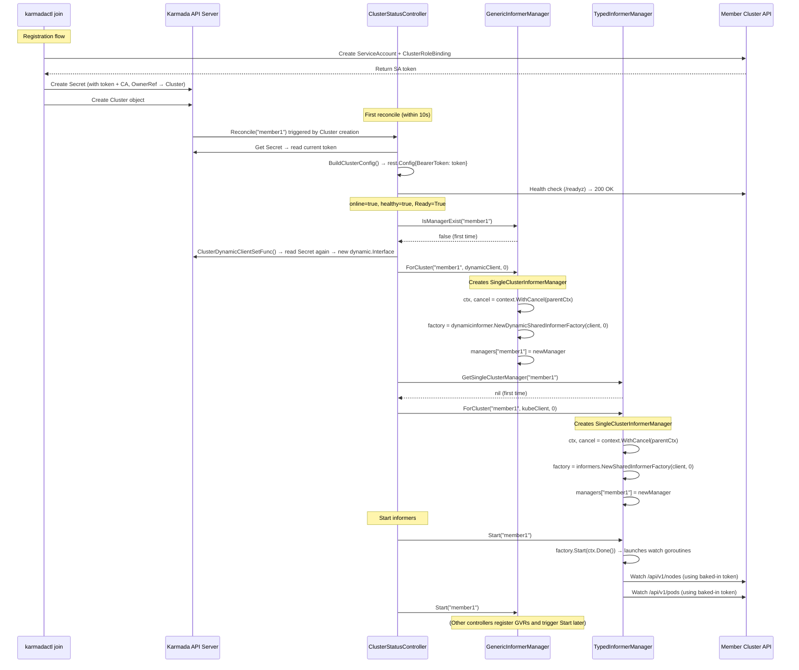
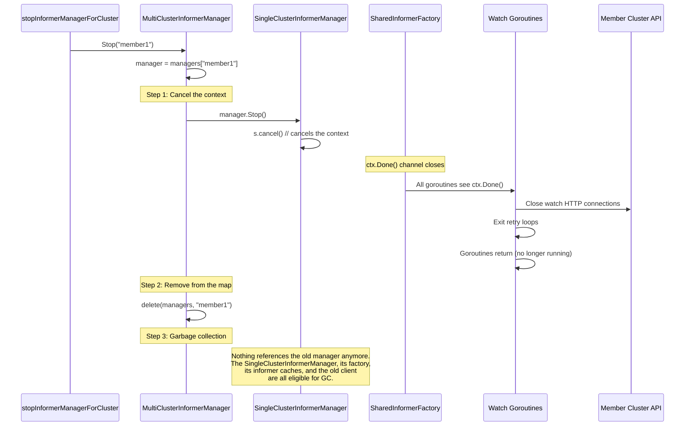
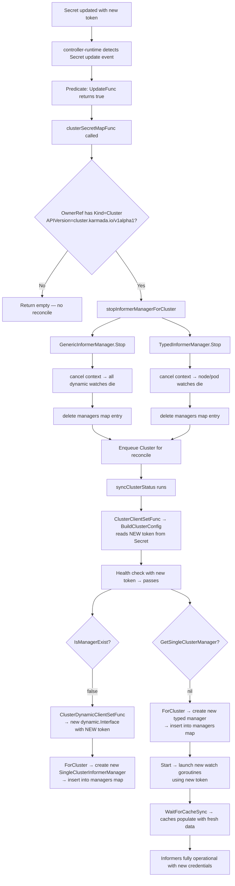

# Fix: Automatic Informer Recovery on Secret Rotation

## Problem

When a push-mode cluster's credential Secret is rotated, Karmada's long-lived informer watches break permanently.

### How informers are built today

**Source files:**
- Controller: `pkg/controllers/status/cluster_status_controller.go`
- Client builder: `pkg/util/membercluster_client.go`
- GenericInformerManager: `pkg/util/fedinformer/genericmanager/multi-cluster-manager.go`
- TypedInformerManager: `pkg/util/fedinformer/typedmanager/multi-cluster-manager.go`

The `ClusterStatusController` reconciles every cluster on a periodic cycle (default 10s). Each cycle, `syncClusterStatus` (`cluster_status_controller.go:181`) builds a **fresh** client via `ClusterClientSetFunc` (`cluster_status_controller.go:191`) → `BuildClusterConfig` (`membercluster_client.go:192`) → `secretGetter` (`membercluster_client.go:209`), which reads the current token from the Secret. This fresh client is used for health checks — which is why health checks always work after rotation.

However, informer managers are **not** rebuilt each cycle. They are lazily initialized and then reused:

1. **GenericInformerManager** (`cluster_status_controller.go:338-348`): `initializeGenericInformerManagerForCluster` checks `IsManagerExist()` (`cluster_status_controller.go:339`). If a manager already exists for that cluster, it returns immediately. Only on the first call does it create a dynamic client via `ClusterDynamicClientSetFunc` (`cluster_status_controller.go:343`) and register the manager with `ForCluster()` (`cluster_status_controller.go:348`).

2. **TypedInformerManager** (`cluster_status_controller.go:353-356`): `buildInformerForCluster` checks `GetSingleClusterManager()` (`cluster_status_controller.go:354`). If nil, it creates the manager via `ForCluster()` with the fresh `clusterClient.KubeClient` (`cluster_status_controller.go:356`). Otherwise it reuses the existing one.

Both managers are only initialized if the cluster is online, healthy, and Ready (`cluster_status_controller.go:212`):
```go
if online && healthy && readyCondition.Status == metav1.ConditionTrue {
    c.initializeGenericInformerManagerForCluster(clusterClient)  // line 223
    // ...
    c.buildInformerForCluster(clusterClient)                     // line 265 (inside setCurrentClusterStatus)
}
```

The clients passed to `ForCluster()` embed the bearer token as a static string in the `rest.Config`:

```go
// membercluster_client.go:220-224
clusterConfig := &rest.Config{
    BearerToken: string(token),  // static snapshot — never refreshed
    Host:        apiEndpoint,
    Timeout:     defaultTimeout,
}
```

After token rotation, the informer managers still exist in the map, so `IsManagerExist` / `GetSingleClusterManager` returns the old manager. The lazy initialization skips recreation. The old manager's watches retry with the stale token, get 401, and retry again — forever.

### Why it doesn't self-heal

The controller only watches `Cluster` objects (`cluster_status_controller.go:175`):
```go
For(&clusterv1alpha1.Cluster{}, builder.WithPredicates(c.PredicateFunc, predicate.GenerationChangedPredicate{}))
```

There is no watch on Secrets. A Secret update does not trigger a reconcile. The periodic requeue does fire every 10 seconds, but it hits the same lazy initialization check — the stale manager exists, so no new one is created.

The existing cluster deletion path (`cluster_status_controller.go:133-135`) does call `Stop()` on both managers, which removes them from the map and allows recreation:
```go
if apierrors.IsNotFound(err) {
    c.GenericInformerManager.Stop(req.NamespacedName.Name)
    c.TypedInformerManager.Stop(req.NamespacedName.Name)
    ...
}
```

But nothing calls `Stop()` on a Secret update — that's the missing piece.

**Impact:** Health checks and resource pushing continue working (they build a fresh client each cycle), but all informer-based functionality breaks silently. To understand the full impact, it helps to know what these informers do.

### What informers Karmada runs on member clusters

Karmada uses two multi-cluster informer manager singletons, both initialized and managed by the `ClusterStatusController`, shared across all controllers:

**GenericInformerManager** — uses a `dynamic.Interface` client to watch arbitrary resource types on member clusters. Because it uses the dynamic client, it can watch any resource — Deployments, ConfigMaps, custom CRDs, anything — without needing compiled-in Go types. It works with `unstructured.Unstructured` objects. Controllers register specific GVRs at runtime based on what they need:

| Controller | What it watches | Purpose |
|---|---|---|
| WorkStatusController | GVRs extracted from `Work` manifests (whatever was propagated) | Collect status of propagated resources back to Work objects |
| ExecutionController | Same cache | Verify resource deployment state, detect drift |
| EndpointSliceCollectController | `discovery.k8s.io/v1/endpointslices` | Collect service endpoints for multi-cluster services |
| ServiceExportController | `serviceexports`, `endpointslices` | Track exported services |
| SearchController | Dynamic per `ResourceRegistry` CRDs | Index member cluster resources for the search API |

**TypedInformerManager** — uses a `kubernetes.Interface` client to watch native Kubernetes types. Watches only nodes and pods, with transform functions that strip objects to minimal fields for memory efficiency:

| Controller | What it watches | Purpose |
|---|---|---|
| ClusterStatusController | `v1/nodes`, `v1/pods` | Resource modeling — `Cluster.Status.ResourceSummary` |
| FederatedHPAController | `v1/pods` | Pod metrics for HPA replica calculations |
| MetricsController | `v1/nodes`, `v1/pods` | Aggregate cluster metrics for the metrics API |

### What breaks when these informers go stale

**GenericInformerManager stale** — Karmada becomes "write-only" for that cluster. It can still push resources but loses all observability:
- Work status stops updating (WorkStatusController can't see member cluster state)
- Drift detection fails (ExecutionController can't see external changes to propagated resources)
- Multi-cluster service endpoints go stale
- Search index freezes for that cluster

**TypedInformerManager stale** — resource modeling freezes:
- `Cluster.Status.ResourceSummary` stops updating (stale allocatable/allocating/allocated)
- Scheduler makes placement decisions on stale capacity data
- FederatedHPA can't scale (no pod metrics)
- Metrics API returns stale data

This does not self-heal.

---

## Informer Manager Internals: Construction, Destruction, and Rebuild

### Data Structures

Karmada uses a two-level map structure to manage informers across all member clusters:

```
┌─────────────────────────────────────────────────────────────────────────────┐
│  MultiClusterInformerManager (singleton, shared across all controllers)      │
│                                                                             │
│  managers map[string]SingleClusterInformerManager                            │
│  ┌───────────┬──────────────────────────────────────────────────────────┐   │
│  │ "member1" │ → SingleClusterInformerManager { ctx, cancel, factory }  │   │
│  │ "member2" │ → SingleClusterInformerManager { ctx, cancel, factory }  │   │
│  │ "member3" │ → SingleClusterInformerManager { ctx, cancel, factory }  │   │
│  └───────────┴──────────────────────────────────────────────────────────┘   │
│                                                                             │
│  lock sync.RWMutex  (protects the map)                                      │
└─────────────────────────────────────────────────────────────────────────────┘
```

There are two of these singletons — one for Generic (dynamic) and one for Typed (kubernetes.Interface):

**GenericInformerManager** (`genericmanager/multi-cluster-manager.go:84-88`):
```go
type multiClusterInformerManagerImpl struct {
    managers map[string]SingleClusterInformerManager
    ctx      context.Context
    lock     sync.RWMutex
}
```

**TypedInformerManager** (`typedmanager/multi-cluster-manager.go:92-97`):
```go
type multiClusterInformerManagerImpl struct {
    managers       map[string]SingleClusterInformerManager
    transformFuncs map[schema.GroupVersionResource]cache.TransformFunc
    ctx            context.Context
    lock           sync.RWMutex
}
```

Each value in the `managers` map is a `SingleClusterInformerManager` — the object that owns all informers for one cluster:

**Generic single-cluster manager** (`genericmanager/single-cluster-manager.go:89-102`):
```go
type singleClusterInformerManagerImpl struct {
    ctx             context.Context
    cancel          context.CancelFunc                              // kills all watches when called
    informerFactory dynamicinformer.DynamicSharedInformerFactory    // creates and holds informers
    syncedInformers map[schema.GroupVersionResource]struct{}        // which caches have synced
    handlers        map[schema.GroupVersionResource][]cache.ResourceEventHandler
    client          dynamic.Interface                               // ← embeds the bearer token
    lock            sync.RWMutex
}
```

**Typed single-cluster manager** (`typedmanager/single-cluster-manager.go:103-122`):
```go
type singleClusterInformerManagerImpl struct {
    ctx              context.Context
    cancel           context.CancelFunc
    informerFactory  informers.SharedInformerFactory
    syncedInformers  map[schema.GroupVersionResource]struct{}
    informers        map[schema.GroupVersionResource]struct{}        // which resources have informers
    startedInformers map[schema.GroupVersionResource]struct{}        // which have been started
    handlers         map[schema.GroupVersionResource][]cache.ResourceEventHandler
    transformFuncs   map[schema.GroupVersionResource]cache.TransformFunc  // strips pods/nodes to minimal fields
    client           kubernetes.Interface                            // ← embeds the bearer token
    lock             sync.RWMutex
}
```

The `client` field is the critical piece — it's a Kubernetes client constructed with a **static bearer token** baked into the `rest.Config`. Every informer created by the factory inherits this client and uses it for its watch connections. When the token is rotated externally, this client becomes permanently unauthorized.

### Normal Construction: What happens when a new cluster is registered

When a new push-mode cluster is registered via `karmadactl join`, the following sequence occurs:



After this point, the managers **persist indefinitely**. On every subsequent reconcile (every 10 seconds), the controller hits the lazy initialization guard:

```go
// initializeGenericInformerManagerForCluster (line 383-384)
if c.GenericInformerManager.IsManagerExist(clusterClient.ClusterName) {
    return  // ← hits this on every cycle after the first
}

// buildInformerForCluster (line 400)
singleClusterInformerManager := c.TypedInformerManager.GetSingleClusterManager(clusterClient.ClusterName)
if singleClusterInformerManager == nil {  // ← not nil after first cycle
    // only creates on first call
}
```

The managers are never recreated unless something removes them from the map first.

### Destruction: What `Stop()` does internally

When `Stop("member1")` is called on the multi-cluster manager, three things happen in sequence:



**In concrete code** (`genericmanager/multi-cluster-manager.go:132-141`):

```go
func (m *multiClusterInformerManagerImpl) Stop(cluster string) {
    manager, exist := m.getManager(cluster)  // look up in the map
    if !exist {
        return
    }
    manager.Stop()           // → calls s.cancel() on the SingleClusterInformerManager
    m.lock.Lock()
    defer m.lock.Unlock()
    delete(m.managers, cluster)  // remove the entry entirely
}
```

**What `s.cancel()` triggers inside the SingleClusterInformerManager:**

The `cancel()` function cancels the context that was passed to `informerFactory.Start(ctx.Done())`. Inside the factory, each informer runs a `Reflector` — a goroutine that:
1. Does an initial `List` of all objects of a given type
2. Opens a long-lived `Watch` connection (HTTP chunked/streaming)
3. Processes events from the watch stream into the local cache
4. On error (including 401 Unauthorized), retries with exponential backoff

All of these goroutines select on `ctx.Done()`. When the context is cancelled:
- Active HTTP watch connections are closed immediately
- Retry loops exit instead of backing off and retrying
- Event processor goroutines drain their queues and stop
- The informer's in-memory store (a thread-safe map of all objects) becomes unreachable

**What `delete(m.managers, cluster)` achieves:**

This is what enables reconstruction. The lazy initialization guards check this map:
- `IsManagerExist("member1")` → does a read-locked map lookup → returns `false`
- `GetSingleClusterManager("member1")` → same lookup → returns `nil`

With the entry gone, the next reconcile will take the "first time" path and create everything fresh.

### Rebuild After Rotation: The full cycle



### Key insight: why cancellation is sufficient for cleanup

You might wonder: why doesn't `Stop()` need to explicitly close each informer, drain event queues, or unregister handlers? The answer is Go's context-based cancellation pattern:

1. **Goroutine lifecycle is tied to the context.** Every goroutine started by the informer factory selects on `ctx.Done()`. Cancelling the context is a single operation that simultaneously signals all goroutines to exit — no need to track and stop them individually.

2. **HTTP connections are closed via context cancellation.** The `rest.Config` creates HTTP transports that respect context cancellation. When `ctx` is cancelled, any in-flight HTTP request (including the long-lived watch stream) is aborted.

3. **Memory is reclaimed by garbage collection.** Once `delete(m.managers, cluster)` removes the only reference to the `SingleClusterInformerManager`, the entire object graph — factory, informers, caches, handlers, the old client with the stale token — becomes unreachable and will be collected by Go's GC.

4. **The old manager cannot be restarted.** A cancelled context cannot be "uncancelled." This is by design — it forces the construction of a completely new manager with a fresh client, rather than attempting to reuse a partially-broken one.

---

## Solution

Add a Secret watch to the `ClusterStatusController`. When a credential Secret is updated:

1. Read the Secret's `OwnerReferences` to identify the owning `Cluster` (set during registration at `pkg/util/credential.go:193-212`)
2. Call `Stop()` on both `GenericInformerManager` and `TypedInformerManager` for that cluster — this cancels watches and deletes the manager from the internal map
3. Enqueue the cluster for reconciliation

The existing reconcile loop already handles the "manager doesn't exist" case — `IsManagerExist` returns false, so a new manager is created with a fresh client built from the updated Secret. No other code changes are needed.

This pattern is already proven in:
- Metrics adapter (`pkg/metricsadapter/controller.go:277-281`)
- Search controller (`pkg/search/controller.go:266,274,280`)

---

## Code Changes

**Single file modified:** `pkg/controllers/status/cluster_status_controller.go`

### 1. Add `stopInformerManagerForCluster` method

```go
func (c *ClusterStatusController) stopInformerManagerForCluster(clusterName string) {
	c.GenericInformerManager.Stop(clusterName)
	c.TypedInformerManager.Stop(clusterName)
}
```

### 2. Add `clusterSecretMapFunc` method

This is the handler for Secret update events. It reads the owner reference to find the cluster, stops the stale informer managers, and enqueues the cluster for reconciliation.

```go
func (c *ClusterStatusController) clusterSecretMapFunc(ctx context.Context, secret client.Object) []controllerruntime.Request {
	var requests []controllerruntime.Request
	for _, ownerRef := range secret.GetOwnerReferences() {
		if ownerRef.Kind != "Cluster" {
			continue
		}
		if ownerRef.APIVersion != clusterv1alpha1.SchemeGroupVersion.String() {
			continue
		}
		klog.V(4).InfoS("Credential secret updated, stopping informer managers for cluster",
			"secret", client.ObjectKeyFromObject(secret), "cluster", ownerRef.Name)
		c.stopInformerManagerForCluster(ownerRef.Name)
		requests = append(requests, controllerruntime.Request{
			NamespacedName: types.NamespacedName{Name: ownerRef.Name},
		})
	}
	return requests
}
```

### 3. Update `SetupWithManager` to add the Secret watch

```go
func (c *ClusterStatusController) SetupWithManager(mgr controllerruntime.Manager) error {
	c.clusterConditionCache = clusterConditionStore{
		successThreshold: c.ClusterSuccessThreshold.Duration,
		failureThreshold: c.ClusterFailureThreshold.Duration,
	}
	return controllerruntime.NewControllerManagedBy(mgr).
		Named(ControllerName).
		For(&clusterv1alpha1.Cluster{}, builder.WithPredicates(c.PredicateFunc, predicate.GenerationChangedPredicate{})).
		Watches(&corev1.Secret{}, handler.EnqueueRequestsFromMapFunc(c.clusterSecretMapFunc),
			builder.WithPredicates(predicate.Funcs{
				CreateFunc:  func(event.CreateEvent) bool { return false },
				UpdateFunc:  func(event.UpdateEvent) bool { return true },
				DeleteFunc:  func(event.DeleteEvent) bool { return false },
				GenericFunc: func(event.GenericEvent) bool { return false },
			})).
		WithOptions(controller.Options{
			RateLimiter: ratelimiterflag.DefaultControllerRateLimiter[controllerruntime.Request](c.RateLimiterOptions),
		}).Complete(c)
}
```

### 4. Add required imports

```go
import (
	"k8s.io/apimachinery/pkg/types"
	"sigs.k8s.io/controller-runtime/pkg/event"
	"sigs.k8s.io/controller-runtime/pkg/handler"
)
```

---

## Test Plan

All tests go in `pkg/controllers/status/cluster_status_controller_test.go`, using the existing `testify/assert` pattern.

### Unit Tests

#### `TestClusterSecretMapFunc`

| Case | Input | Expected |
|---|---|---|
| Secret with Cluster owner ref | Secret with `OwnerReferences: [{Kind: "Cluster", Name: "cluster-1", APIVersion: "cluster.karmada.io/v1alpha1"}]` | Returns `[]Request{{Name: "cluster-1"}}` |
| Secret with no owner refs | Secret with empty `OwnerReferences` | Returns empty slice |
| Secret with non-Cluster owner ref | Secret owned by a Deployment | Returns empty slice |
| Secret with wrong API version | Owner ref with `Kind: "Cluster"` but wrong `APIVersion` | Returns empty slice |

```go
func TestClusterSecretMapFunc(t *testing.T) {
	tests := []struct {
		name     string
		secret   client.Object
		expected []controllerruntime.Request
	}{
		{
			name: "secret with cluster owner ref returns request",
			secret: &corev1.Secret{
				ObjectMeta: metav1.ObjectMeta{
					Name:      "cluster-1-token",
					Namespace: "karmada-cluster",
					OwnerReferences: []metav1.OwnerReference{
						{
							APIVersion: clusterv1alpha1.SchemeGroupVersion.String(),
							Kind:       "Cluster",
							Name:       "cluster-1",
						},
					},
				},
			},
			expected: []controllerruntime.Request{
				{NamespacedName: types.NamespacedName{Name: "cluster-1"}},
			},
		},
		{
			name: "secret with no owner refs returns empty",
			secret: &corev1.Secret{
				ObjectMeta: metav1.ObjectMeta{
					Name:      "unrelated-secret",
					Namespace: "karmada-cluster",
				},
			},
			expected: nil,
		},
		{
			name: "secret with non-cluster owner ref returns empty",
			secret: &corev1.Secret{
				ObjectMeta: metav1.ObjectMeta{
					Name:      "some-secret",
					Namespace: "default",
					OwnerReferences: []metav1.OwnerReference{
						{
							APIVersion: "apps/v1",
							Kind:       "Deployment",
							Name:       "my-app",
						},
					},
				},
			},
			expected: nil,
		},
	}

	for _, tt := range tests {
		t.Run(tt.name, func(t *testing.T) {
			c := &ClusterStatusController{
				GenericInformerManager: genericmanager.GetInstance(),
				TypedInformerManager:   typedmanager.GetInstance(),
			}
			result := c.clusterSecretMapFunc(context.Background(), tt.secret)
			assert.Equal(t, tt.expected, result)
		})
	}
}
```

#### `TestStopInformerManagerForCluster`

Verify that `Stop()` is called on both managers and the manager no longer exists afterward.

```go
func TestStopInformerManagerForCluster(t *testing.T) {
	clusterName := "test-cluster"

	genericMgr := genericmanager.GetInstance()
	typedMgr := typedmanager.GetInstance()

	// Create managers for the cluster
	genericMgr.ForCluster(clusterName, dynamicfake.NewSimpleDynamicClient(runtime.NewScheme()), 0)
	typedMgr.ForCluster(clusterName, fake.NewSimpleClientset(), 0)

	assert.True(t, genericMgr.IsManagerExist(clusterName))
	assert.NotNil(t, typedMgr.GetSingleClusterManager(clusterName))

	// Stop
	c := &ClusterStatusController{
		GenericInformerManager: genericMgr,
		TypedInformerManager:   typedMgr,
	}
	c.stopInformerManagerForCluster(clusterName)

	// Verify both managers are removed
	assert.False(t, genericMgr.IsManagerExist(clusterName))
	assert.Nil(t, typedMgr.GetSingleClusterManager(clusterName))
}
```

#### `TestReconcileRebuildsAfterStop`

End-to-end test verifying the full flow: after `Stop()` is called, the next reconcile creates new managers with fresh credentials.

1. Set up a fake client with a Cluster object and a Secret
2. Run `Reconcile` once — verify managers are created
3. Call `stopInformerManagerForCluster` — verify managers are gone
4. Update the Secret's token data
5. Run `Reconcile` again — verify managers are recreated (simulating the post-rotation rebuild)

### End-to-End Verification Against a Running Control Plane

#### Prerequisites

A local Karmada environment with push-mode member clusters. The setup script creates everything:

```bash
hack/local-up-karmada.sh
```

This provisions:
- A Kind-based host cluster (`karmada-host`) running the Karmada control plane
- Two push-mode member clusters: `member1`, `member2`
- One pull-mode member cluster: `member3`
- Kubeconfigs at `~/.kube/karmada.config` (control plane) and `~/.kube/members.config` (members)

To tear down:
```bash
hack/local-down-karmada.sh
```

#### Step 1: Verify the baseline

Confirm clusters are registered and healthy:

```bash
export KUBECONFIG=~/.kube/karmada.config
kubectl config use-context karmada-apiserver

# All clusters should show Ready=True
kubectl get clusters
```

Identify the credential secret for a push-mode cluster:

```bash
# Get the secret ref for member1
kubectl get cluster member1 -o jsonpath='{.spec.secretRef}'
# Output: {"name":"member1","namespace":"karmada-cluster"}
```

Confirm `ResourceSummary` is populated (proves informers are working):

```bash
kubectl get cluster member1 -o jsonpath='{.status.resourceSummary.allocatable}' | jq .
```

Record the current values — you'll compare against these after rotation.

#### Step 2: Tail the controller-manager logs

In a separate terminal, watch for rotation-related log lines. Use a broad filter to capture both the happy path and potential errors:

```bash
kubectl --context=karmada-host logs -n karmada-system \
  -l app=karmada-controller-manager -f --tail=50 2>&1 \
  | grep -E "Credential secret updated|Created generic informer|Created typed informer|Failed to create a ClusterClient|Failed to build dynamic cluster client"
```

**What each log line means:**

| Log line | Meaning |
|---|---|
| `Credential secret updated, rebuilding informer managers for cluster` | Secret watch fired, `Stop()` called on both managers. The fix is working. |
| `Created generic informer manager with fresh credentials` | GenericInformerManager rebuilt successfully with the new token. |
| `Created typed informer manager with fresh credentials` | TypedInformerManager rebuilt successfully with the new token. |
| `Failed to create a ClusterClient` | `BuildClusterConfig` failed (e.g., secret missing, token invalid). If using a dummy token, this is expected on the next reconcile. |
| `Failed to build dynamic cluster client` | Dynamic client creation failed for the GenericInformerManager. Same root cause as above. |

**Success**: All three lines appear in order within seconds of the patch.

**Failure (fix not working)**: Only `Failed to create a ClusterClient` repeats every 10 seconds with no preceding "Credential secret updated" line — the Secret watch didn't fire.

#### Step 3: Simulate token rotation

Patch the credential secret with a new token value. This is an in-place update (the Secret is not deleted and recreated), which fires the update predicate:

```bash
# Generate a dummy new token (in a real scenario this comes from the member cluster's ServiceAccount)
NEW_TOKEN=$(echo -n "rotated-test-token-$(date +%s)" | base64)

kubectl patch secret member1 -n karmada-cluster \
  --type='merge' \
  -p "{\"data\":{\"token\":\"${NEW_TOKEN}\"}}"
```

#### Step 4: Verify recovery (dummy token — confirms the mechanism fires)

Using a dummy token verifies the watch-stop-rebuild mechanism works. The cluster will eventually go unhealthy (because the dummy token can't authenticate), but the logs confirm the fix triggered correctly.

**Check 1: Logs show the full stop-and-rebuild cycle**

Within seconds of the patch, the log terminal from Step 2 should show all three lines in order:

```
"Credential secret updated, rebuilding informer managers for cluster" secret="karmada-cluster/member1" cluster="member1"
"Created generic informer manager with fresh credentials" cluster="member1"
"Created typed informer manager with fresh credentials" cluster="member1"
```

If you only see the first line without the two "Created" lines, the reconcile is failing before it reaches the informer initialization (likely `BuildClusterConfig` is failing because the dummy token is invalid before the health check passes).

**Check 2: Cluster condition transitions are correct**

Watch the cluster conditions over the next 30-40 seconds:

```bash
# Poll every 5 seconds to observe the transition
for i in $(seq 1 10); do
  echo "=== $(date +%H:%M:%S) ==="
  kubectl get cluster member1 -o jsonpath='{.status.conditions[?(@.type=="Ready")].status} {.status.conditions[?(@.type=="Ready")].reason}' 
  echo
  sleep 5
done
```

Expected timeline with a dummy token:
- **0-30 seconds**: `True ClusterReady` — the `ClusterFailureThreshold` (30s) suppresses the transition
- **After 30 seconds**: `False StatusCollectionFailed` — dummy token causes `BuildClusterConfig` to fail repeatedly, exceeding the threshold

This confirms the threshold mechanism is working correctly — the cluster is NOT marked unhealthy immediately.

**Check 3: No panic or crash in the controller**

```bash
# Controller pod should not have restarted
kubectl --context=karmada-host get pods -n karmada-system -l app=karmada-controller-manager \
  -o jsonpath='{.items[0].status.containerStatuses[0].restartCount}'
# Expected: 0 (same as before the test)
```

#### Step 5: Full round-trip with valid credentials (confirms informers actually recover)

This is the definitive test. Using a real valid token, the cluster should stay healthy and informers should continue producing data after the rotation.

**5a: Get the current valid token from the member cluster**

```bash
# The service account and its token used by Karmada
SA_SECRET=$(kubectl --kubeconfig=~/.kube/members.config --context=member1 \
  get sa karmada -n karmada-system -o jsonpath='{.secrets[0].name}')
VALID_TOKEN=$(kubectl --kubeconfig=~/.kube/members.config --context=member1 \
  get secret ${SA_SECRET} -n karmada-system -o jsonpath='{.data.token}')
```

**5b: Create a workload on the member cluster to produce observable state changes**

Before rotating, deploy something on member1 so informers have something dynamic to report:

```bash
# Deploy directly on the member cluster (bypassing Karmada)
kubectl --kubeconfig=~/.kube/members.config --context=member1 \
  create deployment e2e-canary --image=nginx --replicas=1
```

Record the pod count in `ResourceSummary`:
```bash
kubectl get cluster member1 -o jsonpath='{.status.resourceSummary.allocating}' | jq .
```

**5c: Rotate the secret (with valid token)**

```bash
kubectl patch secret member1 -n karmada-cluster \
  --type='merge' \
  -p "{\"data\":{\"token\":\"${VALID_TOKEN}\"}}"
```

**5d: Verify logs show the rebuild cycle**

Same as Check 1 above — three log lines confirming stop + rebuild.

**5e: Verify cluster stays Ready throughout**

```bash
# Should never transition away from True
kubectl get cluster member1 -o jsonpath='{.status.conditions[?(@.type=="Ready")].status}'
# Expected: True
```

**5f: Verify informers are still producing live data**

Scale the canary deployment and watch `ResourceSummary` reflect the change:

```bash
# Scale up on the member cluster
kubectl --kubeconfig=~/.kube/members.config --context=member1 \
  scale deployment e2e-canary --replicas=3

# Wait 10-15 seconds for the informer cache to sync, then check allocating resources changed
sleep 15
kubectl get cluster member1 -o jsonpath='{.status.resourceSummary.allocating}' | jq .
```

The `allocating` values should increase compared to the baseline (more pods = more allocating resources). If the values are frozen at the pre-rotation snapshot, the informers did NOT recover.

**5g: Verify the GenericInformerManager is also live (drift detection)**

Propagate a resource through Karmada and modify it on the member cluster — if the generic informer is working, Karmada should detect the drift:

```bash
# Create a configmap via Karmada (propagated to member1)
cat <<EOF | kubectl apply -f -
apiVersion: v1
kind: ConfigMap
metadata:
  name: e2e-drift-test
  namespace: default
  labels:
    propagationpolicy.karmada.io/name: e2e-drift
---
apiVersion: policy.karmada.io/v1alpha1
kind: PropagationPolicy
metadata:
  name: e2e-drift
  namespace: default
spec:
  resourceSelectors:
    - apiVersion: v1
      kind: ConfigMap
      name: e2e-drift-test
  placement:
    clusterAffinity:
      clusterNames:
        - member1
EOF

# Wait for propagation
sleep 10

# Modify the configmap directly on the member cluster (simulate drift)
kubectl --kubeconfig=~/.kube/members.config --context=member1 \
  patch configmap e2e-drift-test -n default --type='merge' \
  -p '{"data":{"drifted":"true"}}'

# Wait for Karmada to detect and correct the drift (generic informer must be watching)
sleep 15

# Verify Karmada corrected it (the "drifted" key should be gone)
kubectl --kubeconfig=~/.kube/members.config --context=member1 \
  get configmap e2e-drift-test -n default -o jsonpath='{.data}'
# Expected: no "drifted" key — Karmada overwrote with the desired state
```

If the generic informer is broken, Karmada won't detect the drift and the "drifted" key will remain.

**5h: Cleanup test resources**

```bash
kubectl delete propagationpolicy e2e-drift -n default
kubectl delete configmap e2e-drift-test -n default
kubectl --kubeconfig=~/.kube/members.config --context=member1 \
  delete deployment e2e-canary
```

#### Verification Summary

| Check | What it proves | Pass criteria |
|---|---|---|
| Logs: 3 lines in order | Watch fired, Stop called, managers rebuilt | All 3 lines present |
| Cluster stays Ready (valid token) | Health checks unaffected by rotation | `Ready=True` never transitions |
| ResourceSummary updates after scale | TypedInformerManager is live (pod/node watches working) | `allocating` values change after scaling |
| Drift correction works | GenericInformerManager is live (resource watches working) | Karmada detects and reverts external change |
| No controller restart | Fix doesn't cause panics or crashes | Restart count unchanged |

#### Cleanup

```bash
hack/local-down-karmada.sh
```
